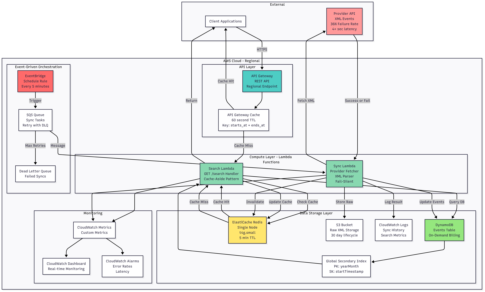
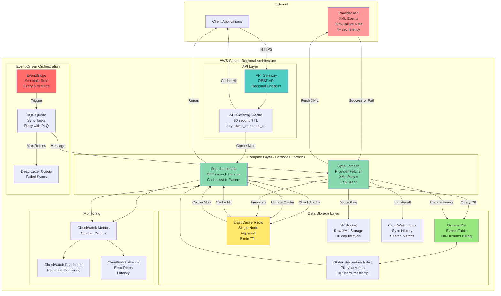
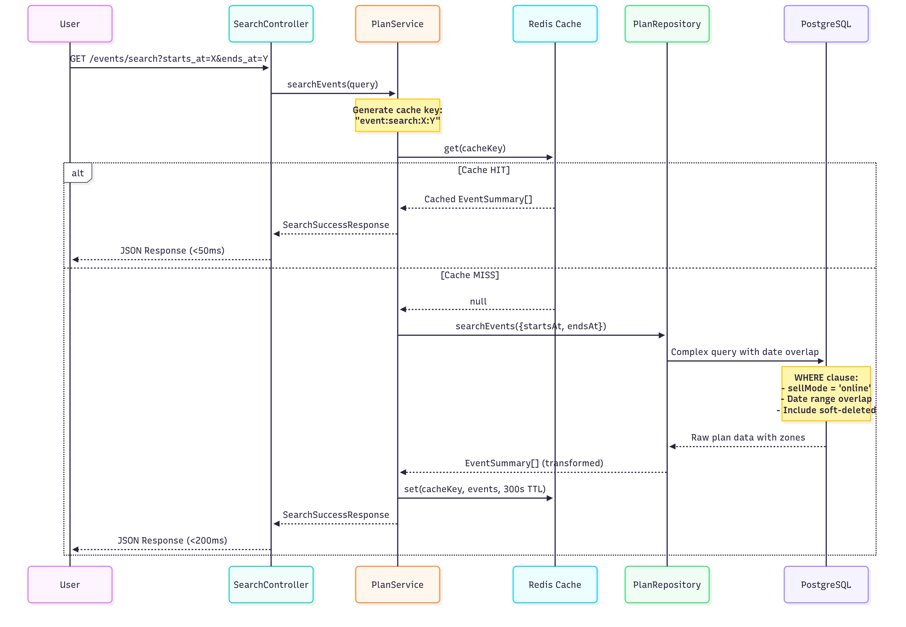
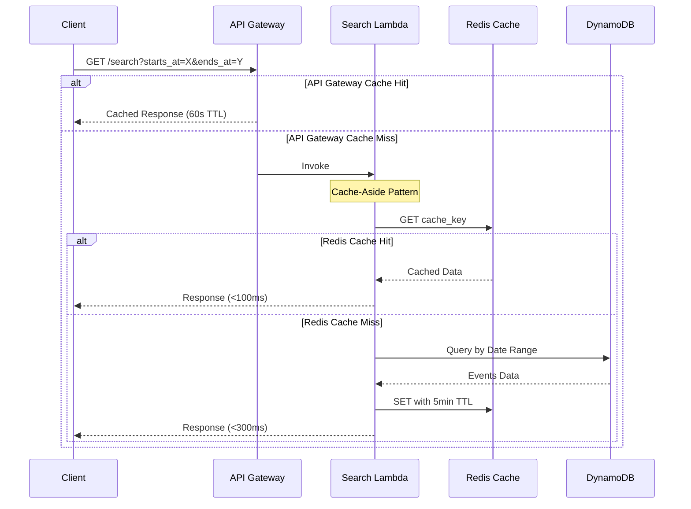
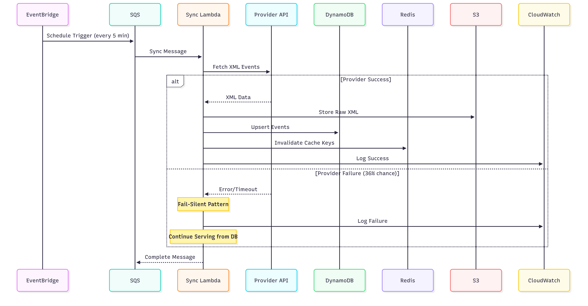
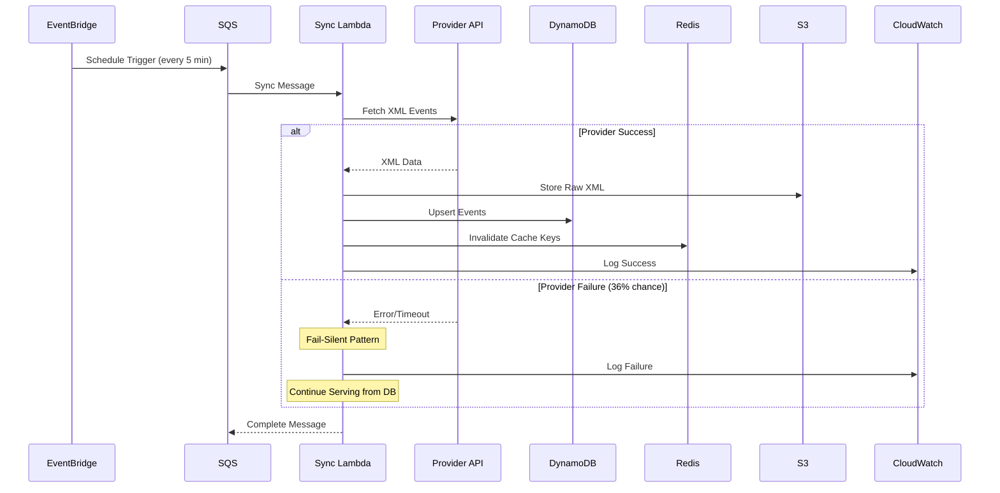

# AWS Serverless Architecture Design - Fever Event Service

## Architecture Overview

A clean, event-driven serverless architecture designed specifically for the Fever challenge requirements. This solution prioritizes simplicity, reliability, and performance.

### Core Design Principles
**Event-Driven Architecture** with clear separation of concerns  
**Cache-Aside Pattern** for optimal performance  
**Fail-Silent Resilience** - simple but effective  
**Regional Architecture** with heavy caching for scale  

---

## Complete Architecture Diagram





---

## Data Flow Patterns



### 1. Search Request Flow (Cache-Aside Pattern)



### 2. Provider Sync Flow (Event-Driven + Fail-Silent)





---

## Component Specifications

### API Gateway
**Type**: Regional REST API (simpler than Edge-optimized)  
**Caching**: 60 second TTL at gateway level  
**Throttling**: 10,000 requests/second burst  
**Integration**: Lambda proxy integration

### Lambda Functions

#### Search Lambda
**Purpose**: Handle GET /search requests  
**Pattern**: Cache-Aside for optimal performance  
**Memory**: 512 MB  
**Timeout**: 10 seconds  
**Concurrency**: Auto-scaling to 1000

#### Sync Lambda
**Purpose**: Fetch from provider and update database  
**Pattern**: Fail-Silent (log and continue on failure)  
**Memory**: 256 MB  
**Timeout**: 30 seconds  
**Reserved Concurrency**: 1 (don't overwhelm provider)

### DynamoDB Design

**Events Table**: Single denormalized table for all event data  
**Partition Strategy**: Optimized for event lookups  
**Global Secondary Index**: Enables efficient date range queries  
**Billing Mode**: On-demand for automatic scaling

### ElastiCache Redis
**Node Type**: cache.t4g.small (1.5 GB RAM)  
**Deployment**: Single node (simpler for PoC)  
**Eviction Policy**: allkeys-lru  
**TTL**: 5 minutes for all cached searches

### EventBridge + SQS
**Schedule**: Rate(5 minutes)  
**Queue Type**: Standard SQS (not FIFO)  
**Visibility Timeout**: 60 seconds  
**Max Retries**: 3  
**DLQ**: After 3 failures

---

## Resilience Strategy

### Fail-Silent Pattern Implementation

```
Provider Fetch Attempt
         ↓
    Success?
    ↙       ↘
  Yes        No
   ↓          ↓
Update DB   Log Error
   ↓          ↓
Clear Cache  Continue
   ↓          ↓
  Done      Done

Note: System continues serving from existing data
```

### Why This Works
**1. Provider Failures Don't Impact Users**: API always serves from cache/database  
**2. No Complex Circuit Breaker State**: Simple try-catch is enough  
**3. Natural Recovery**: Next scheduled sync attempts again  
**4. Zero Downtime**: System never stops serving requests

---

## Scalability Design

### Regional Architecture Benefits
**Simpler**: No cross-region replication complexity  
**Cost-Effective**: Single region reduces data transfer costs  
**Fast**: All components in same region  
**Sufficient**: Can handle 10k+ requests/second

### Caching Strategy for Scale
```
Layer 1: API Gateway Cache (60s)
  ↓ Reduces Lambda invocations by ~70%
Layer 2: Redis Cache (5 min)
  ↓ Reduces DynamoDB reads by ~90%
Layer 3: DynamoDB
  ↓ Auto-scales on-demand
```

### Performance Targets
**P50 Latency**: <50ms (cache hits)  
**P95 Latency**: <200ms (cache miss, DB hit)  
**P99 Latency**: <300ms (worst case)  
**Throughput**: 10,000+ req/s capability

---

## Cost Optimization

### Estimated Monthly Costs

| Service | Configuration | Cost | Notes |
|---------|--------------|------|-------|
| Lambda | 10M requests | $50 | Auto-scaling |
| DynamoDB | On-demand, 1GB | $25 | Pay per request |
| ElastiCache | t4g.small | $20 | Single node |
| API Gateway | 10M requests | $35 | With caching |
| EventBridge | 8,640 invocations | $1 | Every 5 min |
| SQS | 10k messages | $1 | Minimal usage |
| S3 | 10GB storage | $1 | Raw XML storage |
| CloudWatch | Logs & metrics | $10 | Basic monitoring |
| **Total** | **Simple but solid** | **~$143/month** | Highly scalable |

---

## Implementation Simplicity

### Why This Architecture is Simple Yet Professional

**1. Minimal Components**: Only essential AWS services  
**2. Clear Patterns**: Cache-Aside and Fail-Silent are well-understood  
**3. No Over-Engineering**: No Step Functions, no multiple Lambdas  
**4. Standard Practices**: EventBridge for scheduling, SQS for decoupling  
**5. Easy to Debug**: Clear data flow, simple error handling

### Infrastructure as Code Approach

**Framework**: AWS SAM (Serverless Application Model)  
**Structure**: Single template with all resources  
**Deployment**: Simple CLI commands  
**Benefits**: Native AWS support, minimal configuration

---

## Key Architecture Decisions Summary

| Decision | Choice | Rationale |
|----------|--------|-----------|
| **Architecture Style** | Event-Driven | Clean separation, scalable |
| **Data Flow** | Cache-Aside | Simple, effective caching |
| **Resilience** | Fail-Silent | Simple, no state management |
| **Scale Strategy** | Regional + Cache | Cost-effective, sufficient |
| **Database** | DynamoDB | Serverless, auto-scaling |
| **Cache** | ElastiCache Redis | Managed, reliable |
| **Orchestration** | EventBridge + SQS | Simple, decoupled |
| **Monitoring** | CloudWatch | Native AWS integration |

---

## Meeting Challenge Requirements

✅ **Single Endpoint**: GET /search with date range parameters  
✅ **<300ms Response**: Multi-layer caching ensures fast responses  
✅ **36% Provider Failure**: Fail-silent pattern handles gracefully  
✅ **Historical Data**: Events never deleted, lastSeenAt tracking  
✅ **5k-10k req/s Scale**: DynamoDB + caching handles easily  
✅ **XML Processing**: Sync Lambda parses and stores  
✅ **Clean Architecture**: Event-driven with clear separation  
✅ **Cost-Effective**: ~$143/month for production load  
